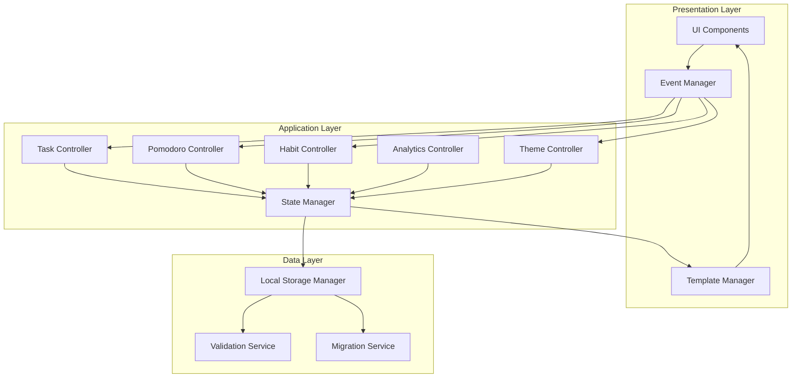

# Technical Design Document: AI LifeOS Dashboard

## Overview

The AI LifeOS Dashboard is a sophisticated, single-page productivity application built entirely with vanilla HTML, CSS, and JavaScript. The system provides a comprehensive personal operating system for productivity management, combining task management, Pomodoro timer, habit tracking, analytics, and personalization features into a unified glassmorphism-styled interface.

### Design Philosophy

This design embraces **progressive enhancement** and **modular architecture** within the constraints of a zero-dependency, client-side application. The architecture prioritizes:

- **Separation of concerns** through module pattern organization
- **Reactive data flow** using pub-sub pattern for state changes
- **Declarative rendering** through template-based DOM updates
- **Resilient data persistence** with versioned Local Storage schema
- **Performance optimization** through debouncing, throttling, and lazy initialization

### Technical Constraints

The design must accommodate strict architectural constraints:

1. **Single-file structure**: All HTML in `index.html`, all styles in `css/style.css`, all logic in `js/script.js`
2. **Zero dependencies**: No frameworks, libraries, or external CDN resources
3. **Client-side only**: No backend, no database, no network requests (except for user-initiated link clicks)
4. **Local Storage only**: All persistence through browser Local Storage API
5. **Static assets**: All images, icons, and media in `/assets/` directory

These constraints drive architectural decisions toward:
- Module pattern for code organization
- Observer pattern for component communication
- Template literal strings for HTML generation
- CSS custom properties for theming
- Functional programming patterns for data transformation


## Architecture

### System Architecture Overview



### Architectural Layers

#### 1. Presentation Layer
**Responsibility**: Render UI components, handle user interactions, manage visual feedback

**Components**:
- **UI Components**: Individual DOM element generators (buttons, cards, inputs)
- **Template Manager**: Generates HTML from templates and data
- **Event Manager**: Centralized event delegation and handling

**Pattern**: The presentation layer uses **template literals** for HTML generation and **event delegation** at the root level to minimize memory footprint.

#### 2. Application Layer
**Responsibility**: Business logic, state transformations, coordination between components

**Controllers**:
- **Task Controller**: CRUD operations, sorting, filtering, priority management
- **Pomodoro Controller**: Timer logic, session management, mode switching
- **Habit Controller**: Habit tracking, streak calculation, daily resets
- **Analytics Controller**: Statistics calculation, badge awarding, progress tracking
- **Theme Controller**: Theme switching, color scheme application

**Pattern**: Controllers follow **Command pattern** for operations and **Observer pattern** for state change notifications.

#### 3. Data Layer
**Responsibility**: Data persistence, validation, schema management, migration


**Services**:
- **Local Storage Manager**: Abstraction over localStorage API with error handling
- **Validation Service**: Schema validation for all persisted data
- **Migration Service**: Handles schema version upgrades

**Pattern**: Data layer implements **Repository pattern** with versioning for resilient persistence.

### Module Organization Strategy

Since all JavaScript must reside in a single `script.js` file, organization follows the **Revealing Module Pattern** with IIFE (Immediately Invoked Function Expressions):

```javascript
// Global namespace
const LifeOS = (function() {
    // Private shared state
    const state = {};
    
    // Individual modules as nested IIFEs
    const StorageManager = (function() { /* ... */ })();
    const StateManager = (function() { /* ... */ })();
    const TaskController = (function() { /* ... */ })();
    // ... other modules
    
    // Public API
    return {
        init: function() { /* ... */ }
    };
})();

// Initialize on DOM ready
document.addEventListener('DOMContentLoaded', LifeOS.init);
```


**Benefits**:
- Clear module boundaries within single file
- Private state encapsulation
- Controlled public interfaces
- No global namespace pollution
- Easy to locate and maintain related code

### State Management Architecture

The application uses a **centralized state object** with **observer pattern** for reactive updates:

```javascript
const StateManager = (function() {
    let state = {
        tasks: [],
        habits: [],
        pomodoro: { /* ... */ },
        user: { /* ... */ },
        theme: 'light',
        analytics: { /* ... */ }
    };
    
    const observers = {};
    
    function subscribe(key, callback) { /* ... */ }
    function notify(key, newValue) { /* ... */ }
    function getState(key) { /* ... */ }
    function setState(key, value) { 
        state[key] = value;
        notify(key, value);
    }
    
    return { subscribe, getState, setState };
})();
```


**State Flow**:
1. User interaction triggers event handler
2. Event handler calls controller method
3. Controller updates state through StateManager
4. StateManager notifies subscribed observers
5. Observers update their respective UI components
6. StateManager persists change to Local Storage

**Benefits**:
- Single source of truth
- Predictable state updates
- Automatic UI synchronization
- Easy to debug state changes
- Decoupled components


## Components and Interfaces

### Core Components

#### 1. Storage Manager

**Purpose**: Provides abstraction over browser Local Storage with error handling, validation, and migration support.

**Interface**:
```javascript
StorageManager = {
    save(key, data, options),      // Save data with optional validation
    load(key, defaultValue),       // Load data with fallback
    remove(key),                   // Delete data
    clear(),                       // Clear all app data
    migrate(),                     // Run schema migrations
    validateSchema(key, data),     // Validate data against schema
    export(),                      // Export all data as JSON
    import(jsonData)               // Import data from JSON
}
```

**Local Storage Schema**:
```javascript
{
    "lifeos_version": "1.0.0",
    "lifeos_tasks": [
        {
            "id": "uuid-v4",
            "title": "string",
            "completed": boolean,
            "priority": "low|medium|high|critical",
            "category": "study|work|health|personal|finance",
            "dueDate": "ISO8601 string or null",
            "createdAt": "ISO8601 timestamp",
            "updatedAt": "ISO8601 timestamp",
            "order": number
        }
    ],
    "lifeos_habits": [
        {
            "id": "uuid-v4",
            "title": "string",
            "streak": number,
            "lastCompletedDate": "ISO8601 date string",
            "completionHistory": ["ISO8601 date strings"]
        }
    ],
    "lifeos_pomodoro": {
        "focusDuration": number,       // minutes
        "shortBreakDuration": number,  // minutes
        "longBreakDuration": number,   // minutes
        "completedSessions": number,
        "totalFocusMinutes": number,
        "sessionHistory": [
            {
                "type": "focus|shortBreak|longBreak",
                "startTime": "ISO8601 timestamp",
                "endTime": "ISO8601 timestamp",
                "completed": boolean
            }
        ]
    },
    "lifeos_user": {
        "name": "string",
        "avatarData": "base64 image data or null",
        "backgroundType": "image|gradient|none",
        "backgroundData": "base64 or gradient string"
    },
    "lifeos_theme": {
        "mode": "light|dark|cyberpunk|ocean|aurora",
        "customColors": {}  // optional overrides
    },
    "lifeos_quickLinks": [
        {
            "id": "uuid-v4",
            "title": "string",
            "url": "string",
            "order": number
        }
    ],
    "lifeos_notes": "string",
    "lifeos_badges": [
        {
            "id": "string",
            "name": "string",
            "earnedAt": "ISO8601 timestamp"
        }
    ]
}
```


**Key Design Decisions**:
- **Prefixed keys** (`lifeos_*`) prevent collisions with other apps
- **Versioning** (`lifeos_version`) enables schema migrations
- **ISO8601 timestamps** for consistent date handling across timezones
- **UUIDs** for stable entity identity
- **Denormalized structure** for fast reads (no joins needed)
- **Base64 encoding** for image data to stay within localStorage
- **Explicit ordering** (order field) for user-controlled sequence

**Storage Quotas**:
- Most browsers: ~5-10MB per domain
- Strategy: Warn user when approaching 80% quota
- Mitigation: Compress large text, limit image sizes, provide export/clear options


#### 2. State Manager

**Purpose**: Centralized state management with reactive update notifications.

**Interface**:
```javascript
StateManager = {
    getState(path),                // Get nested state value (e.g., 'tasks.0.title')
    setState(path, value),         // Set state and notify observers
    subscribe(path, callback),     // Subscribe to state changes
    unsubscribe(path, callback),   // Unsubscribe from changes
    hydrate(data),                 // Initialize state from storage
    snapshot(),                    // Get full state copy (for debugging)
}
```

**Implementation Details**:
- Uses **dot notation** for nested state access: `setState('user.name', 'John')`
- Implements **shallow comparison** to prevent unnecessary re-renders
- Automatically **debounces persistence** (500ms) to avoid excessive localStorage writes
- Maintains **observer registry** as Map for O(1) lookups
- Provides **batch update** capability to group multiple changes


#### 3. Task Controller

**Purpose**: Manages task lifecycle, operations, sorting, and filtering.

**Interface**:
```javascript
TaskController = {
    createTask(data),                    // Add new task
    updateTask(id, updates),             // Update existing task
    deleteTask(id),                      // Remove task
    toggleComplete(id),                  // Toggle completion status
    setTaskOrder(orderedIds),            // Update manual ordering
    sortTasks(criteria),                 // 'date'|'priority'|'status'|'dueDate'
    filterTasks(options),                // Filter by category, priority, status
    searchTasks(query),                  // Text search across title
    getOverdueTasks(),                   // Get tasks past due date
    getDuplicateCheck(title),            // Check for duplicate titles
}
```

**Business Logic**:
- **UUID generation**: Use crypto.randomUUID() or fallback to timestamp-based
- **Duplicate detection**: Case-insensitive title comparison (normalized)
- **Overdue calculation**: Compare dueDate with current date at midnight
- **Sort stability**: Maintain secondary sort by creation date
- **Filter composition**: Support multiple filters simultaneously (AND logic)


#### 4. Pomodoro Controller

**Purpose**: Timer management, session tracking, and mode switching.

**Interface**:
```javascript
PomodoroController = {
    start(),                          // Start/resume timer
    stop(),                           // Pause timer
    reset(),                          // Reset to initial duration
    setMode(mode),                    // 'focus'|'shortBreak'|'longBreak'
    setCustomDuration(mode, minutes), // Override default durations
    getCurrentTime(),                 // Get remaining time in seconds
    getProgress(),                    // Get completion percentage
    onTick(callback),                 // Subscribe to timer updates
    onComplete(callback),             // Subscribe to session completion
}
```

**Implementation Strategy**:
- Use `requestAnimationFrame` for smooth countdown updates (60fps)
- Fallback to `setInterval(100ms)` for browsers without rAF
- Store timer state (running/paused/stopped) separately from duration
- Calculate elapsed time based on start timestamp (not incremental)
- Emit tick events at ~1s intervals for UI updates
- Automatically save session on completion to history


#### 5. Habit Tracker Controller

**Purpose**: Habit management, streak tracking, daily resets.

**Interface**:
```javascript
HabitController = {
    createHabit(title),               // Add new habit
    deleteHabit(id),                  // Remove habit
    completeHabit(id),                // Mark habit complete for today
    uncompleteHabit(id),              // Undo today's completion
    calculateStreak(id),              // Get current streak count
    checkDailyReset(),                // Reset completion flags at midnight
    getCompletionRate(id, days),      // Calculate success rate over period
}
```

**Streak Calculation Logic**:
```javascript
// Pseudo-code
function calculateStreak(habit) {
    const today = getDateOnly(new Date());
    const history = habit.completionHistory.map(getDateOnly).sort();
    
    let streak = 0;
    let currentDate = today;
    
    while (history.includes(formatDate(currentDate))) {
        streak++;
        currentDate = subtractDays(currentDate, 1);
    }
    
    return streak;
}
```

**Daily Reset Strategy**:
- Run check on app initialization
- Compare last reset date with current date
- If different day, clear all `completedToday` flags
- Store last reset date in localStorage


#### 6. Analytics Controller

**Purpose**: Calculate statistics, award badges, track productivity metrics.

**Interface**:
```javascript
AnalyticsController = {
    calculateStats(),                 // Compute all analytics
    getCompletionRate(),              // Percentage of completed tasks
    getCurrentStreak(),               // Days with at least one completion
    getTotalFocusHours(),             // Sum of completed focus sessions
    getWeeklyProgress(),              // This week's completion rate
    checkBadges(),                    // Award new badges if criteria met
    getProductivityScore(),           // Overall score (0-100)
}
```

**Metric Calculations**:

**Completion Rate**:
```
rate = (completedTasks / totalTasks) * 100
```

**Productivity Score** (weighted formula):
```
score = (
    completionRate * 0.4 +
    (currentStreak / 30) * 100 * 0.2 +
    (focusHours / 100) * 100 * 0.2 +
    (badgesEarned / totalBadges) * 100 * 0.2
)
```

**Badge Criteria**:
- "Getting Started": 10 completed tasks
- "Productive": 50 completed tasks
- "Achiever": 100 completed tasks
- "Week Warrior": 7-day completion streak
- "Focus Master": 10 completed focus sessions


#### 7. Theme Controller

**Purpose**: Manage theme switching, apply color schemes, handle customization.

**Interface**:
```javascript
ThemeController = {
    setTheme(themeName),              // 'light'|'dark'|'cyberpunk'|'ocean'|'aurora'
    getTheme(),                       // Get current theme
    setBackground(type, data),        // Set wallpaper or gradient
    applyTheme(),                     // Apply theme to DOM
    preloadTheme(),                   // Prevent flash of unstyled content
}
```

**Theme Implementation Strategy**:

Use **CSS Custom Properties** (CSS variables) for dynamic theming:

```css
:root[data-theme="light"] {
    --bg-primary: #ffffff;
    --bg-secondary: rgba(255, 255, 255, 0.7);
    --text-primary: #1a1a1a;
    --text-secondary: #666666;
    --accent-primary: #6366f1;
    --glass-bg: rgba(255, 255, 255, 0.25);
    --glass-border: rgba(255, 255, 255, 0.3);
    /* ... more variables */
}

:root[data-theme="dark"] {
    --bg-primary: #0f0f0f;
    --bg-secondary: rgba(20, 20, 20, 0.7);
    --text-primary: #ffffff;
    /* ... overrides */
}
```

**Theme Switching Process**:
1. Update `data-theme` attribute on `<html>` element
2. Browser automatically re-evaluates CSS custom properties
3. CSS transitions handle smooth color changes
4. Persist theme choice to localStorage


#### 8. Event Manager

**Purpose**: Centralized event handling with delegation for performance.

**Interface**:
```javascript
EventManager = {
    init(),                           // Set up root-level delegation
    on(selector, eventType, handler), // Register delegated handler
    off(selector, eventType),         // Remove handler
    trigger(element, eventType),      // Programmatic event dispatch
}
```

**Event Delegation Pattern**:
```javascript
// Instead of:
document.querySelectorAll('.task-complete-btn').forEach(btn => {
    btn.addEventListener('click', handler);
});

// Use delegation:
EventManager.on('.task-complete-btn', 'click', (e) => {
    const taskId = e.target.closest('[data-task-id]').dataset.taskId;
    TaskController.toggleComplete(taskId);
});
```

**Benefits**:
- Fewer event listeners (better performance)
- Works with dynamically added elements
- Easier cleanup
- Single source for all event routing


#### 9. Template Manager

**Purpose**: Generate HTML from templates and data.

**Interface**:
```javascript
TemplateManager = {
    renderTask(task),                 // Generate task card HTML
    renderHabit(habit),               // Generate habit item HTML
    renderAnalyticCard(data),         // Generate stat card HTML
    renderQuickLink(link),            // Generate link button HTML
    renderBadge(badge),               // Generate badge icon HTML
}
```

**Template Pattern**:
```javascript
function renderTask(task) {
    const priorityClass = `priority-${task.priority}`;
    const statusClass = task.completed ? 'completed' : '';
    const overdueClass = isOverdue(task) ? 'overdue' : '';
    
    return `
        <div class="task-card ${priorityClass} ${statusClass} ${overdueClass}"
             data-task-id="${task.id}"
             draggable="true">
            <div class="task-header">
                <input type="checkbox" 
                       class="task-checkbox" 
                       ${task.completed ? 'checked' : ''}>
                <span class="task-title">${escapeHtml(task.title)}</span>
            </div>
            <div class="task-meta">
                <span class="task-category">${task.category}</span>
                ${task.dueDate ? `<span class="task-due-date">${formatDate(task.dueDate)}</span>` : ''}
            </div>
            <div class="task-actions">
                <button class="task-edit-btn" aria-label="Edit task">✏️</button>
                <button class="task-delete-btn" aria-label="Delete task">🗑️</button>
            </div>
        </div>
    `;
}
```


**Security Considerations**:
- **XSS Prevention**: Use `escapeHtml()` utility for all user-provided content
- **Avoid `innerHTML` with unsanitized data**
- Sanitization function:
```javascript
function escapeHtml(text) {
    const div = document.createElement('div');
    div.textContent = text;
    return div.innerHTML;
}
```


## Data Models

### Task Entity

```javascript
{
    id: string,                    // UUID v4
    title: string,                 // 1-200 characters
    completed: boolean,            // default: false
    priority: 'low' | 'medium' | 'high' | 'critical',  // default: 'medium'
    category: 'study' | 'work' | 'health' | 'personal' | 'finance',
    dueDate: string | null,        // ISO8601 date or null
    createdAt: string,             // ISO8601 timestamp
    updatedAt: string,             // ISO8601 timestamp
    order: number                  // User-defined sort order
}
```

**Validation Rules**:
- `title`: Required, non-empty after trim, max 200 chars
- `priority`: Must be one of enum values
- `category`: Must be one of enum values
- `dueDate`: Must be valid ISO8601 date or null
- `order`: Non-negative integer

**Invariants**:
- Every task must have unique ID
- `updatedAt >= createdAt`
- If `completed === true`, task should not be marked overdue in UI (only incomplete tasks)


### Habit Entity

```javascript
{
    id: string,                    // UUID v4
    title: string,                 // 1-100 characters
    streak: number,                // Current consecutive completion count
    lastCompletedDate: string | null,  // ISO8601 date of last completion
    completionHistory: string[],   // Array of ISO8601 date strings
    createdAt: string              // ISO8601 timestamp
}
```

**Validation Rules**:
- `title`: Required, non-empty after trim, max 100 chars
- `streak`: Non-negative integer
- `completionHistory`: Array of valid ISO8601 date strings, sorted ascending

**Business Rules**:
- Streak resets to 0 if habit not completed on consecutive day
- `completionHistory` stores all historical completion dates (not just streak period)
- Daily reset clears today's completion flag but preserves history


### Pomodoro Session Entity

```javascript
{
    type: 'focus' | 'shortBreak' | 'longBreak',
    startTime: string,             // ISO8601 timestamp
    endTime: string,               // ISO8601 timestamp
    completed: boolean,            // Did session finish or was it interrupted?
    durationMinutes: number        // Planned duration
}
```

**State Model**:
```javascript
{
    focusDuration: number,         // Minutes, default 25
    shortBreakDuration: number,    // Minutes, default 5
    longBreakDuration: number,     // Minutes, default 15
    completedSessions: number,     // Total count
    totalFocusMinutes: number,     // Cumulative focus time
    sessionHistory: Session[],     // All sessions (limited to last 100)
    currentSession: {
        type: string,
        startTime: string,
        remainingSeconds: number,
        isPaused: boolean
    } | null
}
```

**Validation Rules**:
- Duration settings: 1-60 minutes
- `totalFocusMinutes` should equal sum of completed focus sessions
- `sessionHistory` max length 100 (FIFO when exceeded)


### User Profile Entity

```javascript
{
    name: string,                  // Display name, max 50 chars
    avatarData: string | null,     // Base64 encoded image or null
    backgroundType: 'none' | 'gradient' | 'image',
    backgroundData: string | null, // CSS gradient string or base64 image
    createdAt: string              // ISO8601 timestamp
}
```

**Validation Rules**:
- `name`: Max 50 characters
- `avatarData`: Base64 string starting with `data:image/`, max 500KB
- `backgroundData`: If type='gradient', valid CSS gradient; if type='image', base64 max 2MB

**Image Handling Strategy**:
- Client-side image compression before storage
- Target quality: 85% JPEG compression
- Max dimensions: Avatar 200x200px, Background 1920x1080px
- Use canvas API for resizing and compression


### Quick Link Entity

```javascript
{
    id: string,                    // UUID v4
    title: string,                 // 1-50 characters
    url: string,                   // Valid URL
    order: number,                 // Display order
    createdAt: string              // ISO8601 timestamp
}
```

**Validation Rules**:
- `title`: Required, 1-50 chars
- `url`: Must be valid URL (use URL constructor validation)
- `order`: Non-negative integer

**URL Validation**:
```javascript
function isValidUrl(string) {
    try {
        const url = new URL(string);
        return url.protocol === 'http:' || url.protocol === 'https:';
    } catch {
        return false;
    }
}
```


### Badge Entity

```javascript
{
    id: string,                    // Badge identifier (e.g., 'getting-started')
    name: string,                  // Display name
    description: string,           // Achievement description
    icon: string,                  // Emoji or icon identifier
    earnedAt: string | null,       // ISO8601 timestamp or null if not earned
    criteria: {
        type: 'task_count' | 'session_count' | 'streak_count',
        threshold: number
    }
}
```

**Badge Definitions**:
```javascript
const BADGES = [
    {
        id: 'getting-started',
        name: 'Getting Started',
        description: 'Complete 10 tasks',
        icon: '🎯',
        criteria: { type: 'task_count', threshold: 10 }
    },
    {
        id: 'productive',
        name: 'Productive',
        description: 'Complete 50 tasks',
        icon: '⚡',
        criteria: { type: 'task_count', threshold: 50 }
    },
    {
        id: 'achiever',
        name: 'Achiever',
        description: 'Complete 100 tasks',
        icon: '🏆',
        criteria: { type: 'task_count', threshold: 100 }
    },
    {
        id: 'week-warrior',
        name: 'Week Warrior',
        description: 'Maintain 7-day streak',
        icon: '🔥',
        criteria: { type: 'streak_count', threshold: 7 }
    },
    {
        id: 'focus-master',
        name: 'Focus Master',
        description: 'Complete 10 focus sessions',
        icon: '🧘',
        criteria: { type: 'session_count', threshold: 10 }
    }
];
```


### Theme Configuration

```javascript
{
    mode: 'light' | 'dark' | 'cyberpunk' | 'ocean' | 'aurora',
    customColors: {
        // Optional custom overrides
        [cssVariableName]: string  // hex or rgba color
    }
}
```

**Theme Definitions**:

Each theme defines a complete set of CSS custom properties:

```javascript
const THEMES = {
    light: {
        '--bg-primary': '#f8f9fa',
        '--bg-secondary': 'rgba(255, 255, 255, 0.8)',
        '--text-primary': '#212529',
        '--text-secondary': '#6c757d',
        '--accent-primary': '#6366f1',
        '--accent-secondary': '#8b5cf6',
        '--glass-bg': 'rgba(255, 255, 255, 0.25)',
        '--glass-border': 'rgba(255, 255, 255, 0.3)',
        '--shadow': 'rgba(0, 0, 0, 0.1)',
        // Priority colors
        '--priority-low': '#10b981',
        '--priority-medium': '#f59e0b',
        '--priority-high': '#ef4444',
        '--priority-critical': '#dc2626'
    },
    dark: {
        '--bg-primary': '#0f0f0f',
        '--bg-secondary': 'rgba(20, 20, 20, 0.8)',
        '--text-primary': '#f8f9fa',
        '--text-secondary': '#adb5bd',
        // ... dark variants
    },
    cyberpunk: {
        '--bg-primary': '#0a0e27',
        '--accent-primary': '#00ffff',
        '--accent-secondary': '#ff00ff',
        // ... neon variants
    },
    // ocean and aurora themes...
};
```


## Error Handling

### Error Handling Strategy

**Layered Error Handling**:

1. **Validation Layer**: Prevent invalid data from entering the system
2. **Operation Layer**: Try-catch blocks around critical operations
3. **Storage Layer**: Handle localStorage quota exceeded and access errors
4. **UI Layer**: User-friendly error messages and fallback UI

### Error Categories and Handling

#### 1. Storage Errors

**Quota Exceeded Error**:
```javascript
try {
    localStorage.setItem(key, value);
} catch (e) {
    if (e.name === 'QuotaExceededError') {
        // Show user-friendly message
        showNotification('Storage full. Please clear old data or export your data.', 'error');
        // Offer export option
        offerDataExport();
    }
}
```

**Access Denied Error** (private browsing mode):
```javascript
try {
    const testKey = '__lifeos_test__';
    localStorage.setItem(testKey, 'test');
    localStorage.removeItem(testKey);
} catch (e) {
    // Fallback to in-memory storage
    showNotification('Unable to save data. Changes will be lost on page refresh.', 'warning');
    StorageManager.useFallbackStorage();
}
```


#### 2. Data Validation Errors

**Invalid Input**:
```javascript
function createTask(data) {
    // Validate
    const errors = validateTask(data);
    if (errors.length > 0) {
        showNotification(`Invalid task data: ${errors.join(', ')}`, 'error');
        return { success: false, errors };
    }
    
    // Proceed with creation
    // ...
}
```

**Duplicate Task**:
```javascript
if (TaskController.getDuplicateCheck(title)) {
    showNotification('A task with this title already exists', 'warning');
    return { success: false, error: 'duplicate' };
}
```

#### 3. Data Corruption Errors

**Corrupted Storage Data**:
```javascript
function loadState() {
    try {
        const data = JSON.parse(localStorage.getItem(key));
        
        // Validate schema
        if (!validateSchema(data)) {
            throw new Error('Invalid data schema');
        }
        
        return data;
    } catch (e) {
        console.error('Failed to load data:', e);
        showNotification('Data corrupted. Loading defaults.', 'error');
        return getDefaultState();
    }
}
```


#### 4. Runtime Errors

**Timer Errors**:
```javascript
function startTimer() {
    try {
        if (!state.currentSession) {
            throw new Error('No active session');
        }
        
        // Start timer logic
        timerInterval = setInterval(tick, 1000);
    } catch (e) {
        console.error('Timer error:', e);
        showNotification('Failed to start timer. Please try again.', 'error');
        resetTimer();
    }
}
```

**Image Processing Errors**:
```javascript
async function uploadAvatar(file) {
    try {
        if (file.size > MAX_AVATAR_SIZE) {
            throw new Error('Image too large. Maximum size is 500KB.');
        }
        
        const compressed = await compressImage(file);
        const base64 = await fileToBase64(compressed);
        
        StateManager.setState('user.avatarData', base64);
    } catch (e) {
        console.error('Avatar upload failed:', e);
        showNotification(e.message, 'error');
    }
}
```


### Notification System

**Toast Notification Component**:
```javascript
function showNotification(message, type = 'info', duration = 3000) {
    const toast = document.createElement('div');
    toast.className = `toast toast-${type}`;
    toast.textContent = message;
    
    const container = document.getElementById('toast-container');
    container.appendChild(toast);
    
    // Animate in
    setTimeout(() => toast.classList.add('show'), 10);
    
    // Auto-remove
    setTimeout(() => {
        toast.classList.remove('show');
        setTimeout(() => toast.remove(), 300);
    }, duration);
}
```

**Notification Types**:
- `info`: General information (blue)
- `success`: Successful operation (green)
- `warning`: Non-critical issues (yellow)
- `error`: Critical errors (red)

### Graceful Degradation

**Feature Detection**:
```javascript
const FEATURES = {
    localStorage: checkLocalStorage(),
    webp: checkWebPSupport(),
    customProperties: checkCSSCustomProperties(),
};

function checkLocalStorage() {
    try {
        localStorage.setItem('test', 'test');
        localStorage.removeItem('test');
        return true;
    } catch {
        return false;
    }
}
```


## Testing Strategy

### Testing Approach

This project uses a **dual testing strategy** combining unit tests and manual testing:

1. **Unit Tests**: Test individual functions and business logic
2. **Integration Tests**: Test component interactions and data flow
3. **Manual Testing**: Test UI interactions, visual appearance, and browser compatibility

### Unit Testing

**Test Framework**: None required initially (vanilla JavaScript with assertions)
**Future Enhancement**: Add Jest or Vitest if project scales

**Testable Units**:

#### State Management
- State getter/setter operations
- Observer notifications
- State persistence triggers
- Nested path access (e.g., `getState('tasks.0.title')`)

#### Task Controller Logic
```javascript
// Example test cases
- Creating task with valid data adds to state
- Creating task with empty title fails validation
- Creating duplicate task (same title) fails
- Toggling task completion updates completed flag
- Filtering tasks by category returns correct subset
- Sorting tasks by priority orders correctly (Critical > High > Medium > Low)
- Calculating overdue status correctly based on due date
```


#### Habit Controller Logic
```javascript
// Example test cases
- Completing habit today increments streak if completed yesterday
- Completing habit today resets streak to 1 if not completed yesterday
- Marking habit incomplete removes today from completion history
- calculateStreak() returns correct count for consecutive days
- Daily reset clears completion flags but preserves history
```

#### Pomodoro Timer Logic
```javascript
// Example test cases
- Starting timer from 25:00 counts down correctly
- Pausing timer preserves remaining time
- Resetting timer returns to initial duration
- Timer completion triggers onComplete callback
- Switching modes updates duration correctly
- Custom duration validation (1-60 minutes)
```

#### Analytics Calculations
```javascript
// Example test cases
- Completion rate: 0% when no tasks exist
- Completion rate: 50% when 5 of 10 tasks completed
- Productivity score calculation with all metrics
- Badge awarding at correct thresholds
- Streak calculation counts consecutive completion days
- Weekly progress calculation for current week
```

#### Storage Manager
```javascript
// Example test cases
- save() persists data to localStorage
- load() retrieves saved data
- load() returns default when key doesn't exist
- validateSchema() accepts valid data structure
- validateSchema() rejects invalid data structure
- Migration from version 1.0.0 to 1.1.0 succeeds
```


### Integration Testing

**Test Scenarios**:

#### Task Lifecycle
1. Create task → Verify state update → Verify UI render → Verify storage save
2. Edit task → Verify validation → Verify state update → Verify UI update
3. Complete task → Verify analytics update → Verify badge check → Verify UI update
4. Delete task → Verify removal from state → Verify UI removal → Verify storage update

#### Timer Session Flow
1. Start timer → Verify countdown → Verify progress animation → Complete session → Verify analytics update
2. Start timer → Pause → Resume → Verify time accuracy
3. Start timer → Switch mode → Verify duration change

#### Theme Switching
1. Toggle theme → Verify CSS variable updates → Verify storage save → Reload page → Verify theme persists

#### Data Persistence
1. Add multiple tasks → Reload page → Verify all tasks loaded
2. Modify settings → Reload page → Verify settings restored
3. Fill storage to near quota → Verify warning message

### Manual Testing Checklist

**Browser Compatibility**:
- [ ] Chrome (latest)
- [ ] Firefox (latest)
- [ ] Safari (latest)
- [ ] Edge (latest)

**Responsive Design**:
- [ ] Desktop (1920x1080)
- [ ] Laptop (1366x768)
- [ ] Tablet (768x1024)
- [ ] Mobile (375x667)


**Accessibility**:
- [ ] Keyboard navigation works for all interactive elements
- [ ] Screen reader announces task status changes
- [ ] Focus indicators visible on all focusable elements
- [ ] ARIA labels present on icon buttons
- [ ] Color contrast meets WCAG AA standards

**Performance**:
- [ ] Initial page load < 2 seconds
- [ ] Task list with 100+ items scrolls smoothly
- [ ] Theme switching completes within 300ms
- [ ] Timer updates at consistent 1-second intervals
- [ ] No memory leaks after extended use

**Visual Testing**:
- [ ] Glassmorphism effects render correctly on all backgrounds
- [ ] All animations smooth (60fps)
- [ ] No layout shifts during rendering
- [ ] Text remains readable against all backgrounds
- [ ] Icons and emojis display consistently

**Edge Cases**:
- [ ] Empty state (no tasks, no habits, no links)
- [ ] Very long task titles (truncation/wrapping)
- [ ] Special characters in task titles (emojis, unicode)
- [ ] localStorage disabled/unavailable
- [ ] localStorage quota exceeded
- [ ] Rapid clicking (debouncing)
- [ ] Browser back/forward navigation


### Testing Strategy Summary

**Why Property-Based Testing is NOT Applicable**:

This feature does not benefit from property-based testing because:

1. **UI-heavy application**: The core functionality revolves around DOM manipulation, visual rendering, and user interactions which are not pure functions with universal properties
2. **CRUD operations**: Task and habit management are simple create/read/update/delete operations best tested with specific examples
3. **Browser API integration**: localStorage interactions, timer APIs, and DOM events don't have meaningful universal properties to test
4. **Configuration management**: Theme switching and settings are deterministic state changes best verified with example-based tests
5. **Side effects**: Most operations involve side effects (DOM updates, storage writes, timer state) that don't fit the property-based testing model

**Recommended Approach**:
- **Unit tests** for business logic (calculations, validations, data transformations)
- **Integration tests** for component interactions and data flow
- **Manual testing** for UI behavior, visual appearance, and browser compatibility
- **Snapshot tests** (future enhancement) for UI component consistency


## CSS Architecture and Glassmorphism Design

### CSS File Organization

The single `style.css` file follows this structure:

```css
/* 1. CSS Reset & Base Styles */
/* 2. CSS Custom Properties (Theme Variables) */
/* 3. Typography */
/* 4. Layout (Grid, Flexbox) */
/* 5. Glassmorphism Components */
/* 6. UI Components (Buttons, Inputs, Cards) */
/* 7. Feature Modules (Tasks, Timer, Analytics) */
/* 8. Animations */
/* 9. Utilities */
/* 10. Responsive Breakpoints */
```

### Glassmorphism Implementation

**Core Glassmorphism Properties**:
```css
.glass-card {
    background: var(--glass-bg);
    backdrop-filter: blur(16px) saturate(180%);
    -webkit-backdrop-filter: blur(16px) saturate(180%);
    border: 1px solid var(--glass-border);
    border-radius: 16px;
    box-shadow: 0 8px 32px var(--shadow);
}
```

**Glassmorphism Variants**:
```css
/* Primary card (default) */
.glass-card-primary {
    background: rgba(255, 255, 255, 0.25);
    backdrop-filter: blur(16px);
}

/* Secondary card (less prominent) */
.glass-card-secondary {
    background: rgba(255, 255, 255, 0.15);
    backdrop-filter: blur(10px);
}

/* Elevated card (modals, overlays) */
.glass-card-elevated {
    background: rgba(255, 255, 255, 0.35);
    backdrop-filter: blur(20px);
    box-shadow: 0 16px 48px rgba(0, 0, 0, 0.15);
}
```


### Theme System with CSS Custom Properties

**Base Theme Structure**:
```css
:root {
    /* Spacing */
    --spacing-xs: 4px;
    --spacing-sm: 8px;
    --spacing-md: 16px;
    --spacing-lg: 24px;
    --spacing-xl: 32px;
    
    /* Border Radius */
    --radius-sm: 8px;
    --radius-md: 12px;
    --radius-lg: 16px;
    --radius-full: 9999px;
    
    /* Typography */
    --font-primary: 'Inter', -apple-system, system-ui, sans-serif;
    --font-size-xs: 0.75rem;
    --font-size-sm: 0.875rem;
    --font-size-base: 1rem;
    --font-size-lg: 1.125rem;
    --font-size-xl: 1.25rem;
    --font-size-2xl: 1.5rem;
    --font-size-3xl: 2rem;
    
    /* Transitions */
    --transition-fast: 150ms ease;
    --transition-base: 300ms ease;
    --transition-slow: 500ms ease;
}

:root[data-theme="light"] {
    --bg-primary: #f8f9fa;
    --bg-secondary: #ffffff;
    --text-primary: #212529;
    --text-secondary: #6c757d;
    --accent-primary: #6366f1;
    --accent-secondary: #8b5cf6;
    --glass-bg: rgba(255, 255, 255, 0.25);
    --glass-border: rgba(255, 255, 255, 0.3);
    --shadow: rgba(0, 0, 0, 0.1);
}

:root[data-theme="dark"] {
    --bg-primary: #0f0f0f;
    --bg-secondary: #1a1a1a;
    --text-primary: #f8f9fa;
    --text-secondary: #adb5bd;
    --accent-primary: #818cf8;
    --accent-secondary: #a78bfa;
    --glass-bg: rgba(30, 30, 30, 0.35);
    --glass-border: rgba(255, 255, 255, 0.1);
    --shadow: rgba(0, 0, 0, 0.5);
}
```


:root[data-theme="cyberpunk"] {
    --bg-primary: #0a0e27;
    --bg-secondary: #141b3d;
    --text-primary: #00ffff;
    --text-secondary: #a0c4ff;
    --accent-primary: #ff00ff;
    --accent-secondary: #00ffff;
    --glass-bg: rgba(20, 27, 61, 0.4);
    --glass-border: rgba(0, 255, 255, 0.3);
    --shadow: rgba(255, 0, 255, 0.3);
}

:root[data-theme="ocean"] {
    --bg-primary: #0c2d48;
    --bg-secondary: #145da0;
    --text-primary: #e8f1f5;
    --text-secondary: #b1d4e0;
    --accent-primary: #2e8bc0;
    --accent-secondary: #0c7b93;
    --glass-bg: rgba(20, 93, 160, 0.3);
    --glass-border: rgba(177, 212, 224, 0.25);
    --shadow: rgba(12, 45, 72, 0.4);
}

:root[data-theme="aurora"] {
    --bg-primary: #1a1625;
    --bg-secondary: #2d1b3d;
    --text-primary: #f0e6ff;
    --text-secondary: #c4b0d5;
    --accent-primary: #a78bfa;
    --accent-secondary: #ec4899;
    --glass-bg: rgba(45, 27, 61, 0.35);
    --glass-border: rgba(167, 139, 250, 0.25);
    --shadow: rgba(236, 72, 153, 0.2);
}
```

**Theme Application Function**:
```javascript
function applyTheme(themeName) {
    const html = document.documentElement;
    html.setAttribute('data-theme', themeName);
    
    // Apply transition class
    html.classList.add('theme-transitioning');
    
    // Remove transition class after animation
    setTimeout(() => {
        html.classList.remove('theme-transitioning');
    }, 300);
}
```


### Background Customization

**Wallpaper Implementation**:
```css
.dashboard-background {
    position: fixed;
    top: 0;
    left: 0;
    width: 100%;
    height: 100%;
    z-index: -1;
    transition: opacity var(--transition-slow);
}

.dashboard-background::before {
    content: '';
    position: absolute;
    inset: 0;
    background: var(--bg-primary);
}

.dashboard-background[data-bg-type="image"]::after {
    content: '';
    position: absolute;
    inset: 0;
    background-image: var(--custom-bg-image);
    background-size: cover;
    background-position: center;
    opacity: 0.3; /* Subtle overlay so content remains readable */
}

.dashboard-background[data-bg-type="gradient"]::after {
    content: '';
    position: absolute;
    inset: 0;
    background: var(--custom-bg-gradient);
}
```

**Gradient Presets**:
```javascript
const GRADIENT_PRESETS = {
    sunset: 'linear-gradient(135deg, #667eea 0%, #764ba2 100%)',
    ocean: 'linear-gradient(135deg, #2E3192 0%, #1BFFFF 100%)',
    forest: 'linear-gradient(135deg, #134E5E 0%, #71B280 100%)',
    fire: 'linear-gradient(135deg, #F2709C 0%, #FF9472 100%)',
    twilight: 'linear-gradient(135deg, #0F2027 0%, #203A43 50%, #2C5364 100%)',
};
```


### Layout System

**Grid Layout for Dashboard**:
```css
.dashboard-container {
    display: grid;
    grid-template-columns: repeat(12, 1fr);
    grid-template-rows: auto 1fr auto;
    gap: var(--spacing-lg);
    padding: var(--spacing-xl);
    min-height: 100vh;
}

.hero-section {
    grid-column: 1 / -1;
    grid-row: 1;
}

.sidebar-left {
    grid-column: 1 / 4;
    grid-row: 2;
    display: flex;
    flex-direction: column;
    gap: var(--spacing-lg);
}

.main-content {
    grid-column: 4 / 10;
    grid-row: 2;
}

.sidebar-right {
    grid-column: 10 / -1;
    grid-row: 2;
    display: flex;
    flex-direction: column;
    gap: var(--spacing-lg);
}

/* Responsive breakpoints */
@media (max-width: 1200px) {
    .dashboard-container {
        grid-template-columns: 1fr 2fr 1fr;
    }
    
    .sidebar-left { grid-column: 1 / 2; }
    .main-content { grid-column: 2 / 3; }
    .sidebar-right { grid-column: 3 / 4; }
}

@media (max-width: 768px) {
    .dashboard-container {
        grid-template-columns: 1fr;
        grid-template-rows: auto auto auto auto;
        gap: var(--spacing-md);
        padding: var(--spacing-md);
    }
    
    .hero-section { grid-row: 1; }
    .main-content { grid-row: 2; }
    .sidebar-left { grid-row: 3; }
    .sidebar-right { grid-row: 4; }
}
```


## Animation System

### CSS Animations

**Fade In Animation**:
```css
@keyframes fadeIn {
    from {
        opacity: 0;
        transform: translateY(20px);
    }
    to {
        opacity: 1;
        transform: translateY(0);
    }
}

.fade-in {
    animation: fadeIn 400ms ease-out forwards;
}

/* Staggered fade-in for list items */
.task-card:nth-child(1) { animation-delay: 0ms; }
.task-card:nth-child(2) { animation-delay: 50ms; }
.task-card:nth-child(3) { animation-delay: 100ms; }
.task-card:nth-child(n+4) { animation-delay: 150ms; }
```

**Slide Up Animation**:
```css
@keyframes slideUp {
    from {
        opacity: 0;
        transform: translateY(30px) scale(0.95);
    }
    to {
        opacity: 1;
        transform: translateY(0) scale(1);
    }
}

.slide-up {
    animation: slideUp 300ms cubic-bezier(0.34, 1.56, 0.64, 1);
}
```

**Ripple Effect** (Button Click):
```css
@keyframes ripple {
    from {
        transform: scale(0);
        opacity: 0.6;
    }
    to {
        transform: scale(4);
        opacity: 0;
    }
}

.ripple-container {
    position: relative;
    overflow: hidden;
}

.ripple {
    position: absolute;
    border-radius: 50%;
    background: rgba(255, 255, 255, 0.6);
    animation: ripple 600ms linear;
    pointer-events: none;
}
```

**Ripple JavaScript**:
```javascript
function createRipple(event) {
    const button = event.currentTarget;
    const ripple = document.createElement('span');
    
    const rect = button.getBoundingClientRect();
    const size = Math.max(rect.width, rect.height);
    const x = event.clientX - rect.left - size / 2;
    const y = event.clientY - rect.top - size / 2;
    
    ripple.style.width = ripple.style.height = `${size}px`;
    ripple.style.left = `${x}px`;
    ripple.style.top = `${y}px`;
    ripple.classList.add('ripple');
    
    button.appendChild(ripple);
    
    ripple.addEventListener('animationend', () => ripple.remove());
}
```


**Circular Progress Animation**:
```css
@keyframes progressArc {
    from {
        stroke-dashoffset: 283; /* 2 * π * r (where r = 45) */
    }
    to {
        stroke-dashoffset: var(--progress-offset);
    }
}

.progress-circle {
    transform: rotate(-90deg);
    transform-origin: center;
}

.progress-bar {
    fill: none;
    stroke: var(--accent-primary);
    stroke-width: 8;
    stroke-linecap: round;
    stroke-dasharray: 283;
    stroke-dashoffset: 283;
    animation: progressArc 1s ease-out forwards;
}
```

**Counter Animation**:
```javascript
function animateCounter(element, start, end, duration = 1000) {
    const range = end - start;
    const increment = range / (duration / 16); // 60fps
    let current = start;
    
    const timer = setInterval(() => {
        current += increment;
        
        if ((increment > 0 && current >= end) || (increment < 0 && current <= end)) {
            current = end;
            clearInterval(timer);
        }
        
        element.textContent = Math.round(current);
    }, 16);
}
```

**Pulse Animation** (For active states):
```css
@keyframes pulse {
    0%, 100% {
        transform: scale(1);
        opacity: 1;
    }
    50% {
        transform: scale(1.05);
        opacity: 0.8;
    }
}

.timer-active .timer-display {
    animation: pulse 2s ease-in-out infinite;
}
```

**Shake Animation** (For errors):
```css
@keyframes shake {
    0%, 100% { transform: translateX(0); }
    10%, 30%, 50%, 70%, 90% { transform: translateX(-10px); }
    20%, 40%, 60%, 80% { transform: translateX(10px); }
}

.error-shake {
    animation: shake 500ms ease-in-out;
}
```


### Pomodoro Timer Animated Countdown Ring

**SVG Countdown Ring**:
```html
<svg class="timer-ring" viewBox="0 0 200 200">
    <circle
        class="timer-ring-bg"
        cx="100"
        cy="100"
        r="90"
        fill="none"
        stroke="rgba(255, 255, 255, 0.1)"
        stroke-width="12"
    />
    <circle
        class="timer-ring-progress"
        cx="100"
        cy="100"
        r="90"
        fill="none"
        stroke="var(--accent-primary)"
        stroke-width="12"
        stroke-linecap="round"
        stroke-dasharray="565.48"
        stroke-dashoffset="0"
        transform="rotate(-90 100 100)"
    />
</svg>
```

**Progress Update Function**:
```javascript
function updateTimerRing(percentage) {
    const circumference = 2 * Math.PI * 90; // 565.48
    const offset = circumference - (percentage / 100 * circumference);
    
    const ring = document.querySelector('.timer-ring-progress');
    ring.style.strokeDashoffset = offset;
    ring.style.transition = 'stroke-dashoffset 0.3s linear';
}
```

**Alternative: CSS-only Conic Gradient**:
```css
.timer-ring-css {
    width: 200px;
    height: 200px;
    border-radius: 50%;
    background: conic-gradient(
        var(--accent-primary) var(--progress-degrees),
        rgba(255, 255, 255, 0.1) 0deg
    );
    mask: radial-gradient(transparent 80px, black 80px);
    transition: --progress-degrees 0.3s linear;
}

@property --progress-degrees {
    syntax: '<angle>';
    inherits: false;
    initial-value: 0deg;
}
```

```javascript
// Update CSS variable
function updateTimerRingCSS(percentage) {
    const degrees = (percentage / 100) * 360;
    document.documentElement.style.setProperty('--progress-degrees', `${degrees}deg`);
}
```


## Performance Optimization

### Debouncing and Throttling

**Debounce Implementation**:
```javascript
function debounce(func, delay) {
    let timeoutId;
    
    return function debounced(...args) {
        clearTimeout(timeoutId);
        
        timeoutId = setTimeout(() => {
            func.apply(this, args);
        }, delay);
    };
}

// Usage for auto-save
const autoSaveNotes = debounce((content) => {
    StorageManager.save('lifeos_notes', content);
}, 2000);

notesTextarea.addEventListener('input', (e) => {
    autoSaveNotes(e.target.value);
});
```

**Throttle Implementation**:
```javascript
function throttle(func, limit) {
    let inThrottle;
    
    return function throttled(...args) {
        if (!inThrottle) {
            func.apply(this, args);
            inThrottle = true;
            
            setTimeout(() => {
                inThrottle = false;
            }, limit);
        }
    };
}

// Usage for scroll events
const handleScroll = throttle(() => {
    // Update scroll-based UI
}, 100);

window.addEventListener('scroll', handleScroll);
```

**RequestAnimationFrame Throttle** (for smooth animations):
```javascript
function rafThrottle(func) {
    let rafId = null;
    
    return function throttled(...args) {
        if (rafId === null) {
            rafId = requestAnimationFrame(() => {
                func.apply(this, args);
                rafId = null;
            });
        }
    };
}

// Usage for drag operations
const handleDragMove = rafThrottle((e) => {
    updateDragPreview(e.clientX, e.clientY);
});
```


### Event Delegation

**Centralized Event Handling**:
```javascript
// Instead of adding listeners to each button:
// ❌ Bad approach
document.querySelectorAll('.task-delete-btn').forEach(btn => {
    btn.addEventListener('click', handleDelete); // N listeners
});

// ✅ Good approach
document.addEventListener('click', (e) => {
    if (e.target.matches('.task-delete-btn')) {
        const taskId = e.target.closest('[data-task-id]').dataset.taskId;
        TaskController.deleteTask(taskId);
    }
});
```

**Event Delegation Manager**:
```javascript
const EventManager = (function() {
    const handlers = new Map();
    
    function init() {
        // Single listener at root
        document.addEventListener('click', routeClick);
        document.addEventListener('change', routeChange);
        document.addEventListener('input', routeInput);
    }
    
    function routeClick(e) {
        const target = e.target;
        
        // Task actions
        if (target.matches('.task-complete-btn')) {
            const id = target.closest('[data-task-id]').dataset.taskId;
            TaskController.toggleComplete(id);
        }
        else if (target.matches('.task-delete-btn')) {
            const id = target.closest('[data-task-id]').dataset.taskId;
            TaskController.deleteTask(id);
        }
        // ... other handlers
    }
    
    return { init };
})();
```


### Lazy Initialization

**Load Components On-Demand**:
```javascript
const ModuleLoader = (function() {
    const modules = {
        analytics: null,
        habits: null,
        quickLinks: null,
    };
    
    function loadAnalytics() {
        if (!modules.analytics) {
            modules.analytics = AnalyticsController.init();
        }
        return modules.analytics;
    }
    
    function loadHabits() {
        if (!modules.habits) {
            modules.habits = HabitController.init();
        }
        return modules.habits;
    }
    
    return { loadAnalytics, loadHabits };
})();

// Initialize only when user navigates to section
function showAnalyticsDashboard() {
    const analytics = ModuleLoader.loadAnalytics();
    analytics.render();
}
```

### Memory Management

**Cleanup Event Listeners**:
```javascript
// Store references for cleanup
const listenerRegistry = new WeakMap();

function attachListener(element, event, handler) {
    element.addEventListener(event, handler);
    
    if (!listenerRegistry.has(element)) {
        listenerRegistry.set(element, []);
    }
    listenerRegistry.get(element).push({ event, handler });
}

function cleanupElement(element) {
    const listeners = listenerRegistry.get(element);
    
    if (listeners) {
        listeners.forEach(({ event, handler }) => {
            element.removeEventListener(event, handler);
        });
        listenerRegistry.delete(element);
    }
}
```


### DOM Manipulation Optimization

**Batch DOM Updates**:
```javascript
// ❌ Bad: Multiple reflows
tasks.forEach(task => {
    const element = createTaskElement(task);
    container.appendChild(element); // Reflow for each task
});

// ✅ Good: Single reflow
const fragment = document.createDocumentFragment();
tasks.forEach(task => {
    const element = createTaskElement(task);
    fragment.appendChild(element);
});
container.appendChild(fragment); // Single reflow
```

**Virtual DOM Pattern** (Minimal Implementation):
```javascript
function updateTaskList(tasks) {
    const newHTML = tasks.map(task => renderTask(task)).join('');
    const container = document.getElementById('task-list');
    
    // Only update if content changed
    if (container.dataset.lastHash !== hashString(newHTML)) {
        container.innerHTML = newHTML;
        container.dataset.lastHash = hashString(newHTML);
    }
}

function hashString(str) {
    let hash = 0;
    for (let i = 0; i < str.length; i++) {
        const char = str.charCodeAt(i);
        hash = ((hash << 5) - hash) + char;
        hash |= 0;
    }
    return hash.toString(36);
}
```


## Critical Algorithms

### 1. Streak Calculation Algorithm

**Purpose**: Calculate consecutive days of task completion or habit completion.

**Pseudo-code**:
```
FUNCTION calculateStreak(completionHistory, referenceDate = today):
    IF completionHistory is empty:
        RETURN 0
    
    // Sort dates in descending order (newest first)
    sortedDates = SORT(completionHistory, DESC)
    
    streak = 0
    currentDate = referenceDate
    
    WHILE streak < sortedDates.length:
        dateString = FORMAT(currentDate, 'YYYY-MM-DD')
        
        IF dateString IN sortedDates:
            streak = streak + 1
            currentDate = currentDate - 1 day
        ELSE:
            BREAK
    
    RETURN streak
END FUNCTION
```

**JavaScript Implementation**:
```javascript
function calculateStreak(completionHistory, referenceDate = new Date()) {
    if (!completionHistory || completionHistory.length === 0) {
        return 0;
    }
    
    // Normalize dates to YYYY-MM-DD format
    const dates = completionHistory
        .map(dateStr => dateStr.split('T')[0])
        .sort()
        .reverse();
    
    let streak = 0;
    let currentDate = new Date(referenceDate);
    currentDate.setHours(0, 0, 0, 0); // Normalize to midnight
    
    while (streak < dates.length) {
        const dateString = currentDate.toISOString().split('T')[0];
        
        if (dates.includes(dateString)) {
            streak++;
            currentDate.setDate(currentDate.getDate() - 1);
        } else {
            break;
        }
    }
    
    return streak;
}
```

**Edge Cases**:
- Empty history → return 0
- Single completion → return 1
- Gap in history → stop counting at gap
- Future dates → ignore (only count up to today)


### 2. Productivity Score Formula

**Purpose**: Calculate overall productivity score (0-100) based on multiple metrics.

**Formula Components**:
- **Completion Rate**: 40% weight
- **Streak Consistency**: 20% weight  
- **Focus Hours**: 20% weight
- **Badge Progress**: 20% weight

**Pseudo-code**:
```
FUNCTION calculateProductivityScore(metrics):
    // Component 1: Task completion rate (0-100)
    IF metrics.totalTasks > 0:
        completionRate = (metrics.completedTasks / metrics.totalTasks) * 100
    ELSE:
        completionRate = 0
    
    // Component 2: Streak score (normalized to 30-day max)
    streakScore = MIN(metrics.currentStreak / 30, 1) * 100
    
    // Component 3: Focus hours (normalized to 100-hour max)
    focusScore = MIN(metrics.totalFocusHours / 100, 1) * 100
    
    // Component 4: Badge progress
    badgeScore = (metrics.earnedBadges / metrics.totalBadges) * 100
    
    // Weighted sum
    productivityScore = (
        completionRate * 0.4 +
        streakScore * 0.2 +
        focusScore * 0.2 +
        badgeScore * 0.2
    )
    
    RETURN ROUND(productivityScore)
END FUNCTION
```

**JavaScript Implementation**:
```javascript
function calculateProductivityScore(metrics) {
    const {
        completedTasks = 0,
        totalTasks = 0,
        currentStreak = 0,
        totalFocusHours = 0,
        earnedBadges = 0,
        totalBadges = 5
    } = metrics;
    
    // Completion rate (40% weight)
    const completionRate = totalTasks > 0 
        ? (completedTasks / totalTasks) * 100 
        : 0;
    
    // Streak score (20% weight, normalized to 30 days)
    const streakScore = Math.min(currentStreak / 30, 1) * 100;
    
    // Focus hours (20% weight, normalized to 100 hours)
    const focusScore = Math.min(totalFocusHours / 100, 1) * 100;
    
    // Badge progress (20% weight)
    const badgeScore = (earnedBadges / totalBadges) * 100;
    
    // Weighted sum
    const productivityScore = (
        completionRate * 0.4 +
        streakScore * 0.2 +
        focusScore * 0.2 +
        badgeScore * 0.2
    );
    
    return Math.round(productivityScore);
}
```

**Score Interpretation**:
- 0-25: Getting Started
- 26-50: Building Momentum
- 51-75: Productive
- 76-100: Highly Productive


### 3. Badge Awarding Logic

**Purpose**: Check conditions and award badges when thresholds are met.

**Pseudo-code**:
```
FUNCTION checkAndAwardBadges(state, earnedBadges):
    newBadges = []
    
    FOR EACH badge IN BADGE_DEFINITIONS:
        // Skip if already earned
        IF badge.id IN earnedBadges:
            CONTINUE
        
        // Check criteria
        metCriteria = FALSE
        
        SWITCH badge.criteria.type:
            CASE 'task_count':
                completedCount = COUNT(state.tasks WHERE completed = true)
                metCriteria = completedCount >= badge.criteria.threshold
            
            CASE 'session_count':
                metCriteria = state.pomodoro.completedSessions >= badge.criteria.threshold
            
            CASE 'streak_count':
                currentStreak = calculateStreak(state.completionHistory)
                metCriteria = currentStreak >= badge.criteria.threshold
        
        // Award badge if criteria met
        IF metCriteria:
            newBadges.APPEND({
                id: badge.id,
                name: badge.name,
                earnedAt: NOW()
            })
    
    RETURN newBadges
END FUNCTION
```

**JavaScript Implementation**:
```javascript
function checkAndAwardBadges(state, earnedBadges = []) {
    const newBadges = [];
    const earnedIds = earnedBadges.map(b => b.id);
    
    BADGES.forEach(badge => {
        // Skip if already earned
        if (earnedIds.includes(badge.id)) {
            return;
        }
        
        let metCriteria = false;
        
        // Check criteria based on type
        switch (badge.criteria.type) {
            case 'task_count':
                const completedCount = state.tasks.filter(t => t.completed).length;
                metCriteria = completedCount >= badge.criteria.threshold;
                break;
            
            case 'session_count':
                metCriteria = state.pomodoro.completedSessions >= badge.criteria.threshold;
                break;
            
            case 'streak_count':
                const completionHistory = getCompletionHistory(state);
                const currentStreak = calculateStreak(completionHistory);
                metCriteria = currentStreak >= badge.criteria.threshold;
                break;
        }
        
        // Award badge
        if (metCriteria) {
            newBadges.push({
                id: badge.id,
                name: badge.name,
                description: badge.description,
                icon: badge.icon,
                earnedAt: new Date().toISOString()
            });
            
            // Show celebration notification
            showBadgeEarnedNotification(badge);
        }
    });
    
    return newBadges;
}
```


### 4. Duplicate Task Detection

**Purpose**: Prevent duplicate tasks with same title (case-insensitive).

**Pseudo-code**:
```
FUNCTION isDuplicateTask(newTitle, existingTasks):
    normalizedNewTitle = NORMALIZE(newTitle)
    
    FOR EACH task IN existingTasks:
        normalizedExistingTitle = NORMALIZE(task.title)
        
        IF normalizedNewTitle == normalizedExistingTitle:
            RETURN true
    
    RETURN false
END FUNCTION

FUNCTION NORMALIZE(title):
    result = TRIM(title)
    result = LOWERCASE(result)
    result = REPLACE_MULTIPLE_SPACES(result, ' ')
    RETURN result
END FUNCTION
```

**JavaScript Implementation**:
```javascript
function normalizeTaskTitle(title) {
    return title
        .trim()                           // Remove leading/trailing whitespace
        .toLowerCase()                    // Case-insensitive comparison
        .replace(/\s+/g, ' ');           // Replace multiple spaces with single space
}

function isDuplicateTask(newTitle, existingTasks) {
    const normalizedNew = normalizeTaskTitle(newTitle);
    
    return existingTasks.some(task => {
        const normalizedExisting = normalizeTaskTitle(task.title);
        return normalizedNew === normalizedExisting;
    });
}

// Usage in createTask
function createTask(data) {
    if (isDuplicateTask(data.title, StateManager.getState('tasks'))) {
        showNotification('A task with this title already exists', 'warning');
        return { success: false, error: 'duplicate' };
    }
    
    // Proceed with creation
    // ...
}
```

**Considerations**:
- Normalize whitespace to catch " Task " vs "Task"
- Case-insensitive to catch "task" vs "Task"
- Optional: fuzzy matching for close matches (e.g., Levenshtein distance)


### 5. Overdue Task Calculation

**Purpose**: Identify tasks past their due date.

**Pseudo-code**:
```
FUNCTION isTaskOverdue(task):
    // Only incomplete tasks can be overdue
    IF task.completed:
        RETURN false
    
    // No due date means not overdue
    IF task.dueDate IS NULL:
        RETURN false
    
    taskDueDate = PARSE_DATE(task.dueDate)
    today = TODAY_AT_MIDNIGHT()
    
    RETURN taskDueDate < today
END FUNCTION

FUNCTION getOverdueTasks(tasks):
    overdueTasks = []
    
    FOR EACH task IN tasks:
        IF isTaskOverdue(task):
            overdueTasks.APPEND(task)
    
    // Sort by most overdue first
    SORT overdueTasks BY (today - dueDate) DESC
    
    RETURN overdueTasks
END FUNCTION
```

**JavaScript Implementation**:
```javascript
function isTaskOverdue(task) {
    // Completed tasks are never considered overdue
    if (task.completed) {
        return false;
    }
    
    // No due date means not overdue
    if (!task.dueDate) {
        return false;
    }
    
    // Compare dates at midnight (ignore time component)
    const dueDate = new Date(task.dueDate);
    dueDate.setHours(0, 0, 0, 0);
    
    const today = new Date();
    today.setHours(0, 0, 0, 0);
    
    return dueDate < today;
}

function getOverdueTasks(tasks) {
    const today = new Date();
    today.setHours(0, 0, 0, 0);
    
    return tasks
        .filter(task => isTaskOverdue(task))
        .sort((a, b) => {
            // Sort by most overdue first
            const daysOverdueA = Math.floor((today - new Date(a.dueDate)) / (1000 * 60 * 60 * 24));
            const daysOverdueB = Math.floor((today - new Date(b.dueDate)) / (1000 * 60 * 60 * 24));
            return daysOverdueB - daysOverdueA;
        });
}

// Helper: Get days overdue
function getDaysOverdue(task) {
    if (!isTaskOverdue(task)) {
        return 0;
    }
    
    const dueDate = new Date(task.dueDate);
    const today = new Date();
    const diffMs = today - dueDate;
    return Math.floor(diffMs / (1000 * 60 * 60 * 24));
}
```


### 6. Image Compression Algorithm

**Purpose**: Compress user-uploaded images to fit within localStorage limits.

**Pseudo-code**:
```
FUNCTION compressImage(file, maxWidth, maxHeight, quality):
    // Load image
    image = LOAD_IMAGE(file)
    
    // Calculate new dimensions (maintain aspect ratio)
    aspectRatio = image.width / image.height
    
    IF image.width > maxWidth OR image.height > maxHeight:
        IF aspectRatio > 1:  // Landscape
            newWidth = maxWidth
            newHeight = maxWidth / aspectRatio
        ELSE:  // Portrait
            newHeight = maxHeight
            newWidth = maxHeight * aspectRatio
    ELSE:
        newWidth = image.width
        newHeight = image.height
    
    // Create canvas and draw resized image
    canvas = CREATE_CANVAS(newWidth, newHeight)
    context = canvas.getContext('2d')
    context.drawImage(image, 0, 0, newWidth, newHeight)
    
    // Convert to base64 with quality setting
    base64 = canvas.toDataURL('image/jpeg', quality)
    
    RETURN base64
END FUNCTION
```

**JavaScript Implementation**:
```javascript
function compressImage(file, options = {}) {
    const {
        maxWidth = 200,
        maxHeight = 200,
        quality = 0.85,
        outputFormat = 'image/jpeg'
    } = options;
    
    return new Promise((resolve, reject) => {
        const reader = new FileReader();
        
        reader.onload = (e) => {
            const img = new Image();
            
            img.onload = () => {
                // Calculate new dimensions
                let { width, height } = img;
                const aspectRatio = width / height;
                
                if (width > maxWidth || height > maxHeight) {
                    if (aspectRatio > 1) {
                        width = maxWidth;
                        height = maxWidth / aspectRatio;
                    } else {
                        height = maxHeight;
                        width = maxHeight * aspectRatio;
                    }
                }
                
                // Create canvas
                const canvas = document.createElement('canvas');
                canvas.width = width;
                canvas.height = height;
                
                const ctx = canvas.getContext('2d');
                ctx.drawImage(img, 0, 0, width, height);
                
                // Convert to base64
                const base64 = canvas.toDataURL(outputFormat, quality);
                
                // Check size (localStorage limit: ~5MB)
                const sizeKB = Math.round((base64.length * 3) / 4 / 1024);
                
                if (sizeKB > 500) {
                    // Too large, compress more
                    reject(new Error(`Image too large (${sizeKB}KB). Please use a smaller image.`));
                } else {
                    resolve(base64);
                }
            };
            
            img.onerror = reject;
            img.src = e.target.result;
        };
        
        reader.onerror = reject;
        reader.readAsDataURL(file);
    });
}

// Usage for avatar upload
async function handleAvatarUpload(file) {
    try {
        const compressed = await compressImage(file, {
            maxWidth: 200,
            maxHeight: 200,
            quality: 0.85
        });
        
        StateManager.setState('user.avatarData', compressed);
        showNotification('Avatar updated successfully', 'success');
    } catch (error) {
        showNotification(error.message, 'error');
    }
}

// Usage for wallpaper upload
async function handleWallpaperUpload(file) {
    try {
        const compressed = await compressImage(file, {
            maxWidth: 1920,
            maxHeight: 1080,
            quality: 0.80
        });
        
        StateManager.setState('user.backgroundData', compressed);
        showNotification('Wallpaper updated successfully', 'success');
    } catch (error) {
        showNotification(error.message, 'error');
    }
}
```


## Drag and Drop Implementation

### HTML5 Drag and Drop API

**Task Card Draggable Setup**:
```html
<div class="task-card" 
     data-task-id="uuid" 
     draggable="true">
    <!-- task content -->
</div>
```

**Drag Event Handlers**:
```javascript
function setupDragAndDrop() {
    const taskList = document.getElementById('task-list');
    
    taskList.addEventListener('dragstart', handleDragStart);
    taskList.addEventListener('dragover', handleDragOver);
    taskList.addEventListener('drop', handleDrop);
    taskList.addEventListener('dragend', handleDragEnd);
}

function handleDragStart(e) {
    if (!e.target.matches('.task-card')) return;
    
    draggedElement = e.target;
    
    e.dataTransfer.effectAllowed = 'move';
    e.dataTransfer.setData('text/plain', e.target.dataset.taskId);
    
    // Add dragging visual state
    e.target.classList.add('dragging');
}

function handleDragOver(e) {
    e.preventDefault(); // Necessary to allow drop
    
    const afterElement = getDragAfterElement(taskList, e.clientY);
    const draggable = document.querySelector('.dragging');
    
    if (afterElement == null) {
        taskList.appendChild(draggable);
    } else {
        taskList.insertBefore(draggable, afterElement);
    }
}

function handleDrop(e) {
    e.preventDefault();
    
    const taskId = e.dataTransfer.getData('text/plain');
    
    // Get new order
    const newOrder = Array.from(taskList.children)
        .map(el => el.dataset.taskId);
    
    // Update state
    TaskController.reorderTasks(newOrder);
}

function handleDragEnd(e) {
    e.target.classList.remove('dragging');
}

// Helper: Find element to insert before
function getDragAfterElement(container, y) {
    const draggableElements = [...container.querySelectorAll('.task-card:not(.dragging)')];
    
    return draggableElements.reduce((closest, child) => {
        const box = child.getBoundingClientRect();
        const offset = y - box.top - box.height / 2;
        
        if (offset < 0 && offset > closest.offset) {
            return { offset: offset, element: child };
        } else {
            return closest;
        }
    }, { offset: Number.NEGATIVE_INFINITY }).element;
}
```

**Drag Visual Feedback CSS**:
```css
.task-card {
    transition: transform 0.2s ease, opacity 0.2s ease;
}

.task-card.dragging {
    opacity: 0.5;
    transform: scale(1.05);
    cursor: grabbing;
}

.task-card:not(.dragging) {
    cursor: grab;
}

.task-list.drag-over {
    background: rgba(var(--accent-primary-rgb), 0.05);
}
```


## Local Storage Schema Migration

### Migration Strategy

**Version Management**:
```javascript
const CURRENT_VERSION = '1.0.0';

function migrate() {
    const storedVersion = localStorage.getItem('lifeos_version');
    
    if (!storedVersion) {
        // Fresh install
        initializeDefaults();
        localStorage.setItem('lifeos_version', CURRENT_VERSION);
        return;
    }
    
    if (storedVersion === CURRENT_VERSION) {
        return; // No migration needed
    }
    
    // Run migrations
    if (compareVersions(storedVersion, '1.0.0') < 0) {
        migrateToV1();
    }
    
    if (compareVersions(storedVersion, '1.1.0') < 0) {
        migrateToV1_1();
    }
    
    // Update version
    localStorage.setItem('lifeos_version', CURRENT_VERSION);
}

function compareVersions(v1, v2) {
    const parts1 = v1.split('.').map(Number);
    const parts2 = v2.split('.').map(Number);
    
    for (let i = 0; i < 3; i++) {
        if (parts1[i] > parts2[i]) return 1;
        if (parts1[i] < parts2[i]) return -1;
    }
    return 0;
}
```

**Example Migration: Add Category Field**:
```javascript
function migrateToV1_1() {
    console.log('Migrating to v1.1.0: Adding category field to tasks');
    
    const tasksJson = localStorage.getItem('lifeos_tasks');
    if (!tasksJson) return;
    
    const tasks = JSON.parse(tasksJson);
    
    const migratedTasks = tasks.map(task => ({
        ...task,
        category: task.category || 'personal' // Default category
    }));
    
    localStorage.setItem('lifeos_tasks', JSON.stringify(migratedTasks));
}
```

**Backup Before Migration**:
```javascript
function backupData() {
    const backup = {};
    
    for (let i = 0; i < localStorage.length; i++) {
        const key = localStorage.key(i);
        if (key.startsWith('lifeos_')) {
            backup[key] = localStorage.getItem(key);
        }
    }
    
    localStorage.setItem('lifeos_backup', JSON.stringify(backup));
    localStorage.setItem('lifeos_backup_date', new Date().toISOString());
}

function restoreFromBackup() {
    const backupJson = localStorage.getItem('lifeos_backup');
    if (!backupJson) {
        throw new Error('No backup found');
    }
    
    const backup = JSON.parse(backupJson);
    
    Object.entries(backup).forEach(([key, value]) => {
        localStorage.setItem(key, value);
    });
}
```


## UI Component Patterns

### Button Component

```css
.btn {
    padding: var(--spacing-sm) var(--spacing-lg);
    border: none;
    border-radius: var(--radius-md);
    font-size: var(--font-size-base);
    font-weight: 500;
    cursor: pointer;
    transition: all var(--transition-fast);
    position: relative;
    overflow: hidden;
}

.btn-primary {
    background: var(--accent-primary);
    color: white;
}

.btn-primary:hover {
    background: var(--accent-secondary);
    transform: translateY(-2px);
    box-shadow: 0 8px 16px rgba(0, 0, 0, 0.2);
}

.btn-secondary {
    background: var(--glass-bg);
    backdrop-filter: blur(10px);
    border: 1px solid var(--glass-border);
    color: var(--text-primary);
}

.btn-icon {
    padding: var(--spacing-sm);
    border-radius: var(--radius-full);
    width: 40px;
    height: 40px;
    display: flex;
    align-items: center;
    justify-content: center;
}

.btn:disabled {
    opacity: 0.5;
    cursor: not-allowed;
    transform: none;
}
```

### Input Component

```css
.input {
    width: 100%;
    padding: var(--spacing-md);
    background: var(--glass-bg);
    backdrop-filter: blur(10px);
    border: 2px solid var(--glass-border);
    border-radius: var(--radius-md);
    color: var(--text-primary);
    font-size: var(--font-size-base);
    transition: all var(--transition-base);
}

.input:focus {
    outline: none;
    border-color: var(--accent-primary);
    box-shadow: 0 0 0 3px rgba(var(--accent-primary-rgb), 0.1);
}

.input::placeholder {
    color: var(--text-secondary);
    opacity: 0.6;
}

.input-group {
    display: flex;
    gap: var(--spacing-sm);
    align-items: center;
}

.input-label {
    display: block;
    margin-bottom: var(--spacing-xs);
    font-size: var(--font-size-sm);
    font-weight: 500;
    color: var(--text-secondary);
}
```


### Card Component

```css
.card {
    background: var(--glass-bg);
    backdrop-filter: blur(16px) saturate(180%);
    border: 1px solid var(--glass-border);
    border-radius: var(--radius-lg);
    padding: var(--spacing-lg);
    box-shadow: 0 8px 32px var(--shadow);
    transition: all var(--transition-base);
}

.card:hover {
    transform: translateY(-4px);
    box-shadow: 0 12px 48px var(--shadow);
}

.card-header {
    display: flex;
    justify-content: space-between;
    align-items: center;
    margin-bottom: var(--spacing-md);
}

.card-title {
    font-size: var(--font-size-xl);
    font-weight: 600;
    color: var(--text-primary);
}

.card-body {
    color: var(--text-secondary);
}

.card-footer {
    margin-top: var(--spacing-md);
    padding-top: var(--spacing-md);
    border-top: 1px solid var(--glass-border);
}
```

### Modal Component

```css
.modal-overlay {
    position: fixed;
    inset: 0;
    background: rgba(0, 0, 0, 0.6);
    backdrop-filter: blur(8px);
    display: flex;
    align-items: center;
    justify-content: center;
    z-index: 1000;
    animation: fadeIn 300ms ease-out;
}

.modal {
    background: var(--bg-secondary);
    border: 1px solid var(--glass-border);
    border-radius: var(--radius-lg);
    padding: var(--spacing-xl);
    max-width: 500px;
    width: 90%;
    max-height: 90vh;
    overflow-y: auto;
    box-shadow: 0 24px 64px rgba(0, 0, 0, 0.3);
    animation: slideUp 300ms ease-out;
}

.modal-close {
    position: absolute;
    top: var(--spacing-md);
    right: var(--spacing-md);
    background: transparent;
    border: none;
    font-size: 24px;
    cursor: pointer;
    color: var(--text-secondary);
    transition: color var(--transition-fast);
}

.modal-close:hover {
    color: var(--text-primary);
}
```

**Modal JavaScript**:
```javascript
function showModal(content) {
    const overlay = document.createElement('div');
    overlay.className = 'modal-overlay';
    
    const modal = document.createElement('div');
    modal.className = 'modal';
    modal.innerHTML = `
        <button class="modal-close" aria-label="Close">&times;</button>
        <div class="modal-content">${content}</div>
    `;
    
    overlay.appendChild(modal);
    document.body.appendChild(overlay);
    
    // Close handlers
    overlay.addEventListener('click', (e) => {
        if (e.target === overlay) {
            closeModal(overlay);
        }
    });
    
    modal.querySelector('.modal-close').addEventListener('click', () => {
        closeModal(overlay);
    });
    
    return overlay;
}

function closeModal(overlay) {
    overlay.style.animation = 'fadeOut 300ms ease-out';
    setTimeout(() => overlay.remove(), 300);
}
```


### Circular Progress Indicator

```html
<svg class="progress-ring" width="120" height="120">
    <circle
        class="progress-ring-bg"
        stroke="rgba(255, 255, 255, 0.1)"
        stroke-width="8"
        fill="transparent"
        r="52"
        cx="60"
        cy="60"
    />
    <circle
        class="progress-ring-circle"
        stroke="var(--accent-primary)"
        stroke-width="8"
        fill="transparent"
        r="52"
        cx="60"
        cy="60"
        stroke-dasharray="326.73"
        stroke-dashoffset="0"
        transform="rotate(-90 60 60)"
    />
    <text
        x="60"
        y="60"
        text-anchor="middle"
        dominant-baseline="middle"
        class="progress-text"
        fill="var(--text-primary)"
    >
        75%
    </text>
</svg>
```

**Progress Update Function**:
```javascript
function updateProgress(element, percentage) {
    const circle = element.querySelector('.progress-ring-circle');
    const text = element.querySelector('.progress-text');
    
    const radius = 52;
    const circumference = 2 * Math.PI * radius; // 326.73
    const offset = circumference - (percentage / 100) * circumference;
    
    circle.style.strokeDashoffset = offset;
    circle.style.transition = 'stroke-dashoffset 0.5s ease-out';
    
    // Animate counter
    animateCounter(text, 0, percentage, 500);
}
```


## Accessibility Considerations

### Keyboard Navigation

**Focus Management**:
```css
*:focus {
    outline: 2px solid var(--accent-primary);
    outline-offset: 2px;
}

.btn:focus,
.input:focus {
    outline: 3px solid var(--accent-primary);
    outline-offset: 2px;
}

/* Custom focus indicator for tasks */
.task-card:focus-within {
    box-shadow: 0 0 0 3px rgba(var(--accent-primary-rgb), 0.3);
}
```

**Tab Order**:
```html
<!-- Ensure logical tab order -->
<div class="task-card" tabindex="0">
    <input type="checkbox" tabindex="0" />
    <button class="edit-btn" tabindex="0">Edit</button>
    <button class="delete-btn" tabindex="0">Delete</button>
</div>
```

**Keyboard Shortcuts**:
```javascript
document.addEventListener('keydown', (e) => {
    // Ctrl/Cmd + K: Focus search
    if ((e.ctrlKey || e.metaKey) && e.key === 'k') {
        e.preventDefault();
        document.getElementById('task-search').focus();
    }
    
    // Ctrl/Cmd + N: New task
    if ((e.ctrlKey || e.metaKey) && e.key === 'n') {
        e.preventDefault();
        showNewTaskModal();
    }
    
    // Space: Toggle timer
    if (e.key === ' ' && document.activeElement.matches('.timer-toggle-btn')) {
        e.preventDefault();
        PomodoroController.toggle();
    }
});
```

### ARIA Labels

```html
<!-- Icon buttons need labels -->
<button class="task-delete-btn" aria-label="Delete task">
    🗑️
</button>

<button class="timer-start-btn" 
        aria-label="Start timer"
        aria-pressed="false">
    ▶️
</button>

<!-- Status indicators -->
<div class="task-card" 
     role="listitem"
     aria-label="Task: Complete project"
     aria-describedby="task-meta-1">
    <span class="task-title">Complete project</span>
    <span id="task-meta-1" class="sr-only">
        High priority, due tomorrow, study category
    </span>
</div>

<!-- Screen reader only text -->
<span class="sr-only">
    Current productivity score: 75 out of 100
</span>
```

**Screen Reader Only CSS**:
```css
.sr-only {
    position: absolute;
    width: 1px;
    height: 1px;
    padding: 0;
    margin: -1px;
    overflow: hidden;
    clip: rect(0, 0, 0, 0);
    white-space: nowrap;
    border-width: 0;
}
```

### Color Contrast

**WCAG AA Compliance**:
```javascript
// Ensure 4.5:1 contrast ratio for normal text
// Ensure 3:1 contrast ratio for large text (18pt+)

// Color combinations tested:
const CONTRAST_RATIOS = {
    light: {
        'primary-on-bg': 8.2,      // #212529 on #f8f9fa
        'secondary-on-bg': 4.6,    // #6c757d on #f8f9fa
        'accent-on-bg': 5.1,       // #6366f1 on #f8f9fa
    },
    dark: {
        'primary-on-bg': 14.5,     // #f8f9fa on #0f0f0f
        'secondary-on-bg': 6.8,    // #adb5bd on #0f0f0f
        'accent-on-bg': 7.2,       // #818cf8 on #0f0f0f
    }
};
```


## Security Considerations

### XSS Prevention

**HTML Escaping**:
```javascript
function escapeHtml(text) {
    const div = document.createElement('div');
    div.textContent = text;
    return div.innerHTML;
}

// Usage in templates
function renderTask(task) {
    return `
        <div class="task-card">
            <span class="task-title">${escapeHtml(task.title)}</span>
        </div>
    `;
}
```

**Avoid `eval()` and `innerHTML` with user data**:
```javascript
// ❌ Bad: XSS vulnerability
container.innerHTML = userInput;

// ✅ Good: Use textContent or escaped HTML
container.textContent = userInput;
// OR
container.innerHTML = escapeHtml(userInput);
```

### Content Security Policy

**Recommended CSP Headers** (if hosted):
```html
<meta http-equiv="Content-Security-Policy" 
      content="default-src 'self'; 
               script-src 'self'; 
               style-src 'self' 'unsafe-inline'; 
               img-src 'self' data:; 
               font-src 'self'; 
               connect-src 'none';">
```

### Local Storage Security

**Data Validation**:
```javascript
function validateAndLoad(key, schema) {
    try {
        const data = JSON.parse(localStorage.getItem(key));
        
        // Validate against schema
        if (!validateSchema(data, schema)) {
            console.error('Invalid data schema, using defaults');
            return getDefaultValue(key);
        }
        
        return data;
    } catch (e) {
        console.error('Failed to parse localStorage data:', e);
        return getDefaultValue(key);
    }
}
```

**Sanitize User Uploads**:
```javascript
function validateImageUpload(file) {
    // Check file type
    const validTypes = ['image/jpeg', 'image/png', 'image/gif', 'image/webp'];
    if (!validTypes.includes(file.type)) {
        throw new Error('Invalid file type. Only JPEG, PNG, GIF, and WebP are allowed.');
    }
    
    // Check file size (500KB max for avatar)
    const maxSize = 500 * 1024; // 500KB
    if (file.size > maxSize) {
        throw new Error('File too large. Maximum size is 500KB.');
    }
    
    return true;
}
```


## Browser Compatibility

### Feature Detection

```javascript
const BrowserSupport = {
    localStorage: checkLocalStorage(),
    customProperties: checkCSSCustomProperties(),
    backdropFilter: checkBackdropFilter(),
    
    init() {
        if (!this.localStorage) {
            showWarning('localStorage not supported. Data will not persist.');
            // Fall back to in-memory storage
        }
        
        if (!this.backdropFilter) {
            document.documentElement.classList.add('no-backdrop-filter');
            // Fallback to solid backgrounds
        }
    }
};

function checkLocalStorage() {
    try {
        const test = '__test__';
        localStorage.setItem(test, test);
        localStorage.removeItem(test);
        return true;
    } catch {
        return false;
    }
}

function checkCSSCustomProperties() {
    return window.CSS && window.CSS.supports && 
           window.CSS.supports('color', 'var(--test)');
}

function checkBackdropFilter() {
    return CSS.supports('backdrop-filter', 'blur(10px)') ||
           CSS.supports('-webkit-backdrop-filter', 'blur(10px)');
}
```

### CSS Fallbacks

```css
/* Backdrop filter fallback */
.glass-card {
    background: rgba(255, 255, 255, 0.25);
    backdrop-filter: blur(16px);
    -webkit-backdrop-filter: blur(16px);
}

/* For browsers without backdrop-filter support */
.no-backdrop-filter .glass-card {
    background: rgba(255, 255, 255, 0.85);
}

/* Grid fallback for older browsers */
.dashboard-container {
    display: grid;
    grid-template-columns: repeat(12, 1fr);
}

@supports not (display: grid) {
    .dashboard-container {
        display: flex;
        flex-wrap: wrap;
    }
}
```

### Vendor Prefixes

```css
.transform-element {
    -webkit-transform: translateY(-4px);
    -moz-transform: translateY(-4px);
    -ms-transform: translateY(-4px);
    transform: translateY(-4px);
}

.glass-card {
    -webkit-backdrop-filter: blur(16px);
    backdrop-filter: blur(16px);
}
```

